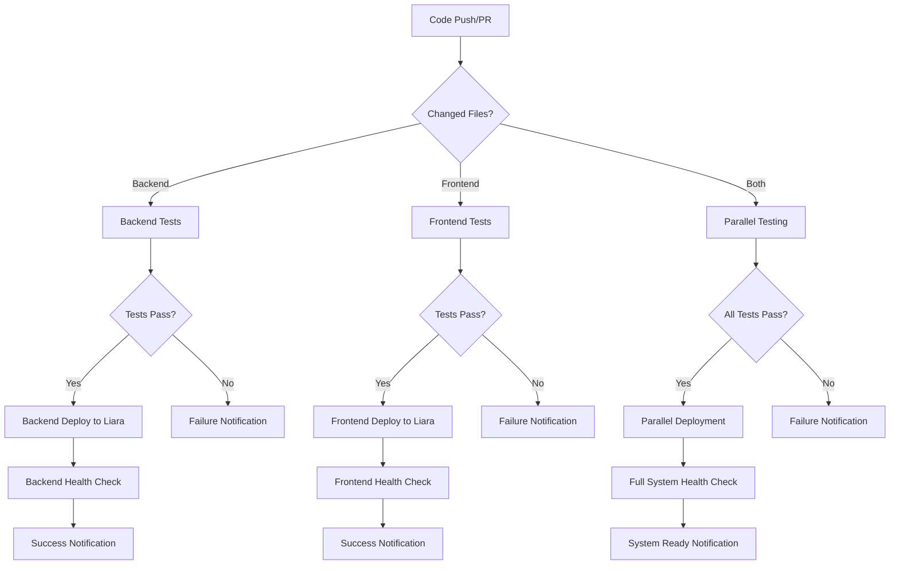

# Design Document

## Overview

The GitHub Actions CI/CD system will provide automated build, test, and deployment workflows for the TikTrue platform. The system consists of multiple workflow files that handle different aspects of the deployment pipeline, including backend Django deployment, frontend React deployment, testing, and monitoring.

## Architecture

### Workflow Structure
```
.github/workflows/
├── backend-deploy.yml      # Backend Django deployment to Liara
├── frontend-deploy.yml     # Frontend React deployment to Liara
├── test-backend.yml        # Backend testing and quality checks
├── test-frontend.yml       # Frontend testing and quality checks
├── security-scan.yml       # Security vulnerability scanning
└── notify.yml              # Notification and monitoring workflow
```

### Deployment Flow


## Components and Interfaces

### 1. Backend Deployment Workflow
**File:** `.github/workflows/backend-deploy.yml`

**Triggers:**
- Push to main branch (backend files changed)
- Manual workflow dispatch
- Pull request (testing only)

**Steps:**
1. Checkout code
2. Setup Python 3.11
3. Install dependencies
4. Run tests (pytest)
5. Run security scan (bandit)
6. Build and deploy to Liara
7. Health check verification
8. Notification

**Environment Variables:**
- `LIARA_API_TOKEN`: Liara authentication token
- `SECRET_KEY`: Django secret key
- `DATABASE_URL`: Production database URL
- `CORS_ALLOWED_ORIGINS`: Allowed CORS origins

### 2. Frontend Deployment Workflow
**File:** `.github/workflows/frontend-deploy.yml`

**Triggers:**
- Push to main branch (frontend files changed)
- Manual workflow dispatch
- Pull request (testing only)

**Steps:**
1. Checkout code
2. Setup Node.js 22
3. Install dependencies (npm ci)
4. Run tests (npm test)
5. Run linting (eslint)
6. Build production bundle
7. Deploy to Liara
8. Health check verification
9. Notification

**Environment Variables:**
- `LIARA_API_TOKEN`: Liara authentication token
- `REACT_APP_API_BASE_URL`: Backend API URL
- `REACT_APP_BACKEND_URL`: Backend base URL
- `REACT_APP_FRONTEND_URL`: Frontend URL

### 3. Testing Workflows

#### Backend Testing (`test-backend.yml`)
- Unit tests with pytest
- Integration tests
- Code coverage reporting
- Security vulnerability scanning
- Code quality checks with flake8

#### Frontend Testing (`test-frontend.yml`)
- Unit tests with Jest
- Component testing with React Testing Library
- ESLint code quality checks
- Build verification
- Bundle size analysis

### 4. Security Scanning Workflow
**File:** `.github/workflows/security-scan.yml`

**Backend Security:**
- Bandit for Python security issues
- Safety for dependency vulnerabilities
- SAST (Static Application Security Testing)

**Frontend Security:**
- npm audit for dependency vulnerabilities
- ESLint security rules
- Bundle analysis for security issues

### 5. Notification System
**File:** `.github/workflows/notify.yml`

**Notification Channels:**
- GitHub Issues (for failures)
- Email notifications
- Slack/Discord webhooks (optional)
- GitHub commit status updates

## Data Models

### Workflow Configuration
```yaml
# Common workflow structure
name: Workflow Name
on:
  push:
    branches: [main]
    paths: ['specific/path/**']
  pull_request:
    branches: [main]
    paths: ['specific/path/**']
  workflow_dispatch:

jobs:
  job_name:
    runs-on: ubuntu-latest
    steps:
      - name: Step Name
        uses: action@version
        with:
          parameter: value
        env:
          SECRET: ${{ secrets.SECRET_NAME }}
```

### Liara Deployment Configuration
```yaml
# Backend deployment step
- name: Deploy to Liara
  uses: liara-ir/liara-cli@v1
  with:
    api-token: ${{ secrets.LIARA_API_TOKEN }}
    app: tiktrue-backend
    platform: django
    path: ./backend
```

### Health Check Configuration
```yaml
# Health check verification
- name: Health Check
  run: |
    sleep 30  # Wait for deployment
    curl -f https://tiktrue-backend.liara.run/health/ || exit 1
    curl -f https://tiktrue-frontend.liara.run/ || exit 1
```

## Error Handling

### Deployment Failures
1. **Build Failures:** Stop pipeline, notify developers with build logs
2. **Test Failures:** Block deployment, create GitHub issue with test results
3. **Deployment Failures:** Attempt rollback, notify with deployment logs
4. **Health Check Failures:** Mark deployment as failed, investigate

### Rollback Strategy
1. **Automatic Rollback:** For health check failures
2. **Manual Rollback:** Via workflow dispatch with previous version
3. **Database Rollback:** Manual process with backup restoration
4. **Cache Invalidation:** Clear CDN and application caches

### Retry Logic
- Network failures: 3 retries with exponential backoff
- Deployment failures: 2 retries with manual intervention option
- Health checks: 5 retries over 2 minutes

## Testing Strategy

### Pipeline Testing
1. **Workflow Validation:** YAML syntax and structure validation
2. **Dry Run Testing:** Test workflows without actual deployment
3. **Staging Environment:** Test full pipeline in staging before production
4. **Rollback Testing:** Verify rollback procedures work correctly

### Quality Gates
1. **Code Coverage:** Minimum 80% coverage required
2. **Security Scan:** No high/critical vulnerabilities allowed
3. **Performance:** Build time under 10 minutes
4. **Health Checks:** All endpoints must respond within 30 seconds

### Monitoring and Metrics
1. **Deployment Success Rate:** Track successful vs failed deployments
2. **Build Time Metrics:** Monitor and optimize build performance
3. **Test Coverage Trends:** Track coverage improvements over time
4. **Security Vulnerability Trends:** Monitor security posture

## Security Considerations

### Secrets Management
- All sensitive data stored in GitHub Secrets
- Secrets rotation policy (quarterly)
- Principle of least privilege for API tokens
- Audit logging for secret access

### Access Control
- Branch protection rules for main branch
- Required reviews for workflow changes
- Restricted workflow dispatch permissions
- Audit trail for all deployments

### Security Scanning
- Dependency vulnerability scanning
- Static code analysis
- Container image scanning (if applicable)
- Infrastructure as Code security checks

## Performance Optimization

### Caching Strategy
- Node.js dependencies caching
- Python dependencies caching
- Docker layer caching
- Build artifact caching

### Parallel Execution
- Backend and frontend workflows run in parallel
- Test suites parallelized where possible
- Independent deployment of components
- Concurrent health checks

### Resource Optimization
- Efficient Docker images
- Minimal dependency installation
- Optimized build processes
- Resource usage monitoring